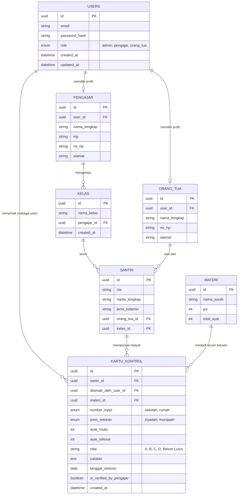

# Entity Relationship Diagram (ERD)
**Proyek:** HafalTrack

Database direlasikan dengan memperhatikan kapabilitas multi-role, di mana baik Pengajar maupun Orang Tua dapat melakukan operasi *insert* pada tabel riwayat hafalan (Kartu Kontrol).

## 1. Diagram Relasi Entitas (Mermaid Syntax)

## 2. Penjelasan Struktur Tabel

### Tabel Master & Autentikasi
*   **`USERS`**: Tabel pusat untuk autentikasi sistem. Kolom `role` menentukan level akses.
*   **`PENGAJAR` & `ORANG_TUA`**: Tabel profil spesifik yang berelasi *One-to-One* dengan `USERS` melalui `user_id`. Ini memisahkan data kredensial dengan data biodata.
*   **`SANTRI`**: Tabel anak/siswa. Berelasi *Many-to-One* dengan `ORANG_TUA` (1 Orang tua bisa punya banyak anak) dan `KELAS` (mengidentifikasi posisi halaqoh saat ini).
*   **`KELAS`**: Tempat pengelompokkan santri yang diampu oleh seorang pengajar.
*   **`MATERI`**: Katalog referensi (misal: Al-Fatihah, Juz 30, Ayat 1-7) agar penulisan surah pada saat input setoran seragam.

### Tabel Transaksional (Inti Aplikasi)
*   **`KARTU_KONTROL`**: Tabel yang berfungsi sebagai *Log* atau histori setoran.
    *   `santri_id`: Siapa yang menyetor.
    *   `disimak_oleh_user_id`: Berelasi langsung ke tabel `USERS`. Ini kunci utamanya. Baik Pengajar maupun Orang Tua (yang login menggunakan akun `USERS` mereka) akan dicatat ID-nya di sini sebagai pihak yang menginput data.
    *   `sumber_input`: Menentukan konteks lokasi/otoritas (enum: `sekolah` jika diinput Pengajar, `rumah` jika diinput Orang Tua). Ini akan memudahkan Frontend (Vue.js) melakukan *conditional rendering* (seperti membedakan warna card di UI).
    *   `is_verified_by_pengajar`: Flag *boolean*. Secara default `true` jika diinput oleh Pengajar. Jika diinput oleh Orang Tua, default-nya `false` dan bisa diubah menjadi `true` apabila pengajar menekan tombol verifikasi di aplikasinya (jika aturan sekolah mewajibkan validasi).